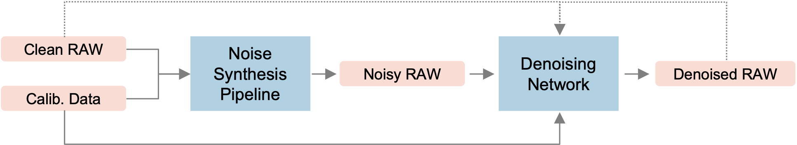
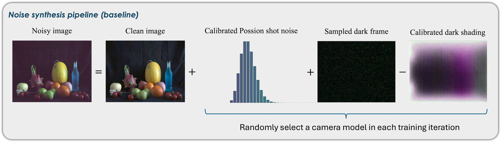

## AIM 2025 Challenge on Low-light Real-world RAW Image Denoising Using Synthetic Data


This repository holds the baseline method for the ICCV-associated AIM 2025 RAW image denoising challenge. In this challenge, we seek algorithms that address the low-light RAW image denosing problem without reliance on real-world noisy-clean image pairs in a **camera-agnostic manner (i.e., a single network applicable to multiple cameras)**, such as noise-synthesis based methods. 


## IMPORTANT NOTES
- For participants who focus on **designing new network architectures and utilizing our default noise synthesis pipeline**, our provided `save_for_stage1_submission.py` file can be used directly. For participants who also **come up with new noise synthesis pipelines**, the `datasets/real_eval_dataset.py` file may also need updates.
- We expect the predicted image to be **already scaled-up by the designated digital gains (dgain), cropped to the range of `(0, 1)`, and stored in the RGGB format in the shape of `(H, W, 4)`**.
- Due to the restrictions of CodaLab, we need to **center_crop each image's visible area to (512,512,4)`, and save it in a uint16 numpy file** in the dev phase. Please keep the related settings as it is to avoid any errors.


## Introduction of the baseline method
The provided baseline trains a U-Net with synthesized noisy-clean image pairs. The data synthesis pipeline is based on the method proposed [here](https://arxiv.org/abs/2505.00045). Briefly, signal-dependent noise is synthesized as a Poisson noise using calibrated gains, and signal-independent noise is synthesized by directly sampling from camera-captured dark-shading-corrected dark frames.






### Dataset
**Clean images to synthesize noise on:** While there are no restrictions on the employed training datasets as long as detailed in the final fact sheet. We use **all the long-exposure Sony RAW images from the  [SID dataset](https://cchen156.github.io/SID.html)** to train the baseline.

**Camera noise calibration materials & Inputs noisy images for benchmarking:** We include 4 cameras (SonyA7R4, SonyA6700, SonyZVE10M2, and Canon70D) in the benchmark dataset. To ease realistic noisy image synthesis, we release the 4-camera noise profiling materials. The overall folder structure is as follows:

```
dev_phase_release/
├── canon70d/
    └── calib_res/
        └── dark_shading_iso{}.npy  ## Pre-calibrated dark shadings for each ISO
        └── sys_gain.npz  ## The calibrated ISO-to-system-gain pairs for shot noise synthesis
        └── vis/  ## visualization of the calibration res
    └── dark_frame/
        └── iso{}/  ## dark frames for each ISO for signal-independent noise profiling, 50 frames for each ISO
    └── test_data/
        └── paired_input/  ## Noisy input images for the development-stage benchmarking.
            └── scene{}_iso{}_dgain{}.CR2.  ## The digital gain needs to be applied to this noisy input for brightness alignment w.r.t. the GT
        └── in_the_wild/  ## Sample images that will be used in the final stage for NR-IQA. These images are NOT used in scoring in the dev phase, but just give a general concept about what will be used in the test 
├── sonya6700/
    └── 
├── sonyzve10m2/
    └── 
└── sonya7r4/
    └── 
```


### File Structure
Most files' functions go by their names. Here we note some important ones:

- `datasets/camera_config.yaml` records the necessary config info of the 4 cameras in evaluation.
- `datasets/synth_train_dataset.py` implements the aforementioned baseline noisy synthesis method.   
- `save_for_stage1_submission.py`: See the following.


## Save your results for submission
`save_for_stage1_submission.py` implements the scripts that conduct model inference and results packing. Please modify the necessary lines to use your architecture and directories. 


